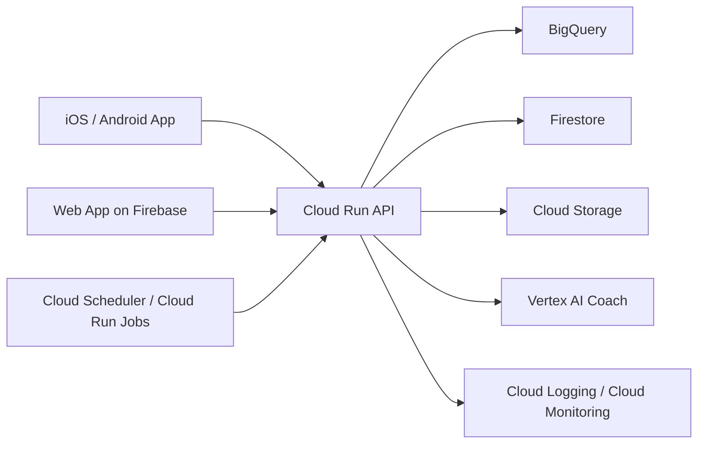

# Google-First MVP Architecture

## Purpose

This document defines the Google-first target architecture for the hackathon MVP and near-term evolution.

Local DuckDB remains useful for rapid prototyping, but the primary deployment direction is Google-native because:

- Google is sponsoring the hackathon
- the product needs a credible hosted story
- the app includes a chatbot and regular user engagement flows
- managed services reduce infrastructure overhead

Within that Google-first approach, Firebase should be the primary application platform for the MVP.

## Architecture Principles

- Google-first for target deployment
- Firebase-first for the app experience layer
- Flutter-first for the primary client application layer
- mobile and web friendly from day one
- chatbot-safe by design
- support recurring engagement, not only a static demo
- preserve a clean path from hackathon MVP to real rollout

## Chosen MVP Stack

The current chosen MVP stack is:

- Flutter
- Firebase
- Cloud Run
- Vertex AI

This should be treated as the default implementation direction unless we explicitly record a new ADR.

## Recommended Stack

### Firebase Platform Layer

Firebase should be the default platform layer for the MVP:

- Firebase Hosting for the Flutter web companion experience
- Firebase Authentication for sign-in
- Cloud Firestore for app state and coach sessions
- Firebase Cloud Messaging for notifications and re-engagement
- Firebase Analytics for product measurement
- Firebase Remote Config for controlled tuning of prompts, nudges, and experiments
- Firebase Crashlytics for mobile reliability

This gives us one coherent app platform across iOS, Android, and web.

### Frontend

- Flutter is the chosen client stack for iOS, Android, and the companion web experience
- Firebase Hosting is the default delivery path for Flutter Web
- Firebase App Hosting should only be considered later if we introduce a separate framework-based web surface

### Mobile

- Flutter is the chosen client stack for the MVP
- Flutter gives us one codebase for iOS and Android and may also support selected web reuse
- native mobile apps remain possible later, but are not the recommended MVP path

### Authentication

- Firebase Authentication

Recommended sign-in order:

1. Email-based sign-in for broad accessibility
2. Google sign-in as optional convenience

### Backend

- Cloud Run for APIs and orchestration

Use Cloud Run for:

- patient data APIs
- six-pillar score and trajectory calculation services
- chatbot orchestration
- offer recommendation logic

### Data Layer

- BigQuery for cloud analytical tables, pillar state tables, and trajectory features
- Firestore for app state, coach sessions, plans, and lightweight realtime product state
- Cloud Storage for raw files, exports, and supporting assets

### Engagement And Measurement

- Firebase Cloud Messaging for cross-platform notifications and re-engagement
- Firebase Analytics for funnel and retention measurement
- Firebase Remote Config for tuning copy, nudges, and journey variations without a full redeploy
- Firebase Crashlytics for stability monitoring on mobile

### AI Layer

- Vertex AI for the coach or chatbot

Use Vertex AI for:

- explaining compass changes and six-pillar interactions
- generating tailored weekly plans
- answering user questions
- converting flags into understandable action

Grounding order:

1. patient-specific curated features
2. internal product or evidence content
3. optional public grounding only for non-patient-specific wellness explanations

### Operations

- Secret Manager
- Cloud Logging
- Cloud Monitoring
- Cloud Scheduler and Cloud Run Jobs

## Lovable Positioning

Lovable can be used as a rapid product-design and web-prototyping accelerator.

Recommended use:

- quick concept exploration
- UI idea generation
- landing-page or web-flow prototyping
- fast experimentation for non-core surfaces

Not recommended as the core system architecture for this MVP because our chosen implementation stack is Flutter plus Firebase plus Cloud Run plus Vertex AI.

In short:

- use Lovable to accelerate exploration
- keep Flutter and Firebase as the real product foundation

## Topology

## Why This Fits The Problem Statement

The brief describes a client that is losing the patient interface to more engaging digital players while sitting on fragmented data.

This architecture fits that problem because it supports:

- a consumer-grade mobile and web experience
- a Firebase-centered app platform that is strong for mobile and web delivery
- a Flutter-first mobile delivery model for regular usage
- a six-pillar compass as the central product object
- fast iteration on personalized journeys
- hosted chatbot functionality
- managed services instead of heavy infrastructure operations
- a believable 12-month launch path

## Local Versus Cloud

Keep both of these ideas true:

- local DuckDB remains the fastest place to prototype data logic
- Firebase is the primary app platform for hosted MVP delivery
- Google Cloud is the primary target for hosted MVP deployment

That means DuckDB is now a development convenience, while Firebase plus Google Cloud form the real MVP architecture story.

## Current Implementation Slice

The current repo should support this path:

1. Local DuckDB for rapid data and payload iteration
2. FastAPI for the app-facing Compass API
3. Flutter app source checked into `apps/longevity_compass/`
4. Firebase reserved for authentication, analytics, notifications, crash monitoring, and web hosting
5. Cloud Run as the deployment target for the Python API

The Flutter app can be scaffolded in source form before generated platform folders are added. Once the Flutter toolchain is available, run `flutter create . --platforms=ios,android,web` inside the app directory to generate the platform shell around the checked-in app code.

## Recommended Build Sequence

1. Finalize primary persona, journey, and monetization model
2. Finalize the Longevity Compass product slice
3. Use local data and APIs to validate payloads and logic
4. Finalize six-pillar compass payloads and trajectory logic
5. Build the core Flutter app for iOS and Android
6. Build the companion web experience on Firebase
7. Move hosted APIs to Cloud Run
8. Move cloud analytical tables to BigQuery
9. Add Vertex AI coach orchestration
10. Use Lovable only if it helps accelerate selected web or concept flows

## Official Google References

- [Firebase for Flutter](https://firebase.google.com/docs/flutter)
- [Firebase App Hosting](https://firebase.google.com/docs/app-hosting)
- [Firebase Authentication](https://firebase.google.com/docs/auth/)
- [Cloud Firestore](https://firebase.google.com/docs/firestore)
- [Firebase Cloud Messaging](https://firebase.google.com/docs/cloud-messaging)
- [Google Analytics for Firebase](https://firebase.google.com/docs/analytics)
- [Firebase Remote Config](https://firebase.google.com/docs/remote-config)
- [Firebase Crashlytics](https://firebase.google.com/docs/crashlytics)
- [Cloud Run](https://cloud.google.com/run)
- [BigQuery](https://cloud.google.com/bigquery?hl=com)
- [Cloud Storage](https://cloud.google.com/storage/docs/objects)
- [Vertex AI Overview](https://docs.cloud.google.com/vertex-ai/docs/start/introduction-unified-platform)
- [Cloud Monitoring](https://docs.cloud.google.com/monitoring/docs)

## Optional Prototyping Reference

- [Lovable Documentation](https://docs.lovable.dev/)
